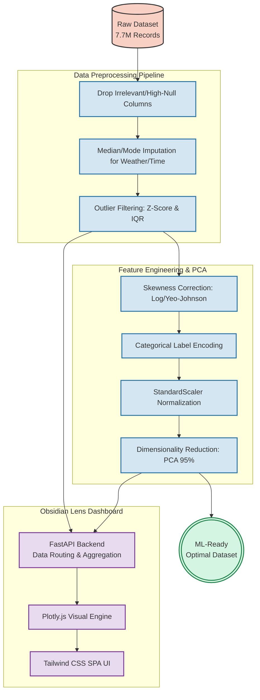

# Road Accident Severity Analysis

[](https://www.python.org/)
[](https://fastapi.tiangolo.com/)
[](https://tailwindcss.com/)
[](https://pandas.pydata.org/)
[](https://scikit-learn.org/)
[](https://plotly.com/)

A comprehensive end-to-end data science project performing exploratory data analysis (EDA), data preprocessing, feature engineering, and dimensionality reduction on the **US Accidents (March 2023)** dataset, which contains over **7.7 million** accident records spanning across the United States.

This project is fully integrated with a custom-engineered **Obsidian Lens Data Intelligence Dashboard**—a highly responsive, beautiful dark-themed Single Page Application (SPA) powered by FastAPI and Plotly.js to explore live geospatial, temporal, and correlational insights.

---

## 📑 Table of Contents
- [Overview](#-overview)
- [Obsidian Lens Web Dashboard](#-obsidian-lens-web-dashboard-new)
- [System Architecture & Pipeline](#-system-architecture--pipeline)
- [Dataset Details](#-dataset-details)
- [Project Workflow](#-project-workflow)
  - [Phase 1: Data Preprocessing](#phase-1-data-preprocessing)
  - [Phase 2: Exploratory Data Analysis](#phase-2-exploratory-data-analysis)
  - [Phase 3: Feature Engineering & PCA](#phase-3-feature-engineering--pca)
- [Advanced Visualizations](#-advanced-visualizations)
- [Key Analytical Insights](#-key-analytical-insights)
- [Getting Started](#-getting-started)
- [Technologies Used](#-technologies-used)

---

## 🎯 Overview

This project analyzes traffic accident data to understand the factors driving accident severity across the US. The end-to-end pipeline handles everything from systematic imputation of missing values and multi-stage outlier removal to complex geospatial/temporal visualizations, skewness correction, categorical encoding, and Principal Component Analysis (PCA). The resulting optimized dataset is both heavily visualized for business intelligence and optimally refined for predictive machine learning models.

---

## 🌌 Obsidian Lens Web Dashboard (NEW)

The project now includes a fully localized, state-of-the-art interactive web application mapping the complete Jupyter Data Science pipeline into a gorgeous UI/UX layout.

**Dashboard Features:**
- **Single Page Application (SPA):** Seamless routing across `Overview`, `Distribution`, `Correlation`, and `Insights` modules without page reloads.
- **Dynamic Feature Selector:** An interactive dropdown replacing static outputs, allowing you to cycle through physical feature distributions (Temperature, Humidity, Visibility, etc.) entirely on the fly.
- **Live Computations:** Instantly computes live **Skewness Indexes** and **Kurtosis Profiles** via backend endpoints for active feature selection.
- **Interactive Plotly Visuals:** Tooltips, zooming, panning, and automatic responsive layout rescaling implemented for every graph (Geo Histograms, Temporal Heatmaps, PCA 2D Scatters).
- **Recent Incident Feed:** The `/api/data-snapshot` feeds a live data table showing real accident structures and operational categorizations.

## 🏗️ System Architecture & Pipeline



---

## 💾 Dataset Details

| Property       | Detail                                           |
|----------------|--------------------------------------------------|
| **Source**      | US Accidents (March 2023)                        |
| **Records**     | 7,728,394                                        |
| **Features**    | 46 columns                                       |
| **Coverage**    | 49 US contiguous states                          |
| **Time Span**   | February 2016 – March 2023                      |

### Feature Categories

| Category                | Important Variables                                                                                         |
|-------------------------|-------------------------------------------------------------------------------------------------------------|
| **Severity**            | `Severity` (Scale 1–4 indicating accident impact on traffic)                                                 |
| **Location**            | `Start_Lat`, `Start_Lng`, `City`, `State`, `Zipcode`                                                        |
| **Time/Weather**        | `Start_Time`, `Temperature(F)`, `Humidity(%)`, `Visibility(mi)`, `Wind_Speed(mph)`, `Weather_Condition`       |
| **Road Features**       | `Traffic_Signal`, `Junction`, `Crossing`, `Station`, `Stop` (Boolean Indicators)                             |

---

## 🚀 Project Workflow

### Phase 1: Data Preprocessing
- **Data Reduction:** Dropped overly-sparse columns (`End_Lat`, `End_Lng`) and non-impactful identifiers.
- **Strategic Imputation:** 
  - Median combinations for `Wind_Chill` and `Temperature`.
  - Group-by based imputation for `Humidity`, `Pressure`, and `Visibility` dependent on `State` and `Weather_Condition`.
  - Mode imputation for categorical sequences.
- **Robust Outlier Removal:**
  - Applied **Z-score** (thresh=5) on weather properties.
  - Used **IQR method** for scaling distance and visibility thresholds.
  - Reduced dataset size cleanly by ~2 million skewed/anomalous observations.

### Phase 2: Exploratory Data Analysis
- Distribution visualization to unbalance factors.
- Correlation matrices to observe multicollinearity (e.g., dropping `Wind_Chill(F)` due to extreme positive relation to `Temperature(F)`).
- Visuals natively integrated into the web dashboard.

### Phase 3: Feature Engineering & PCA
- **Skewness Correction:** Applied `np.log1p` on Right-skewed data (`Distance(mi)`, `Pressure(in)`) and **Yeo-Johnson PowerTransformer** on complex skew combinations.
- **Label Encoding:** Dynamically isolated all `object` and `boolean` columns to translate them into ML-compatible numeral structures via `LabelEncoder`.
- **Scaling:** Used `StandardScaler` to bring all remaining numerical variables to a uniform plane.
- **Dimensionality Reduction (PCA):** Synthesized the complete matrix through Principal Component Analysis ensuring **95% explained variance retention**, optimizing the feature space for faster, scalable modeling.

---

## 📊 Advanced Visualizations

The project includes custom advanced visual interpretations ensuring robust geographical and temporal inferences natively available in the Web SPA and the Notebook:

1. 🗺️ **Spatial Accident Density Map:** Rendering the continental mapping of the US strictly through the longitude and latitude scatter of auto incidents (effectively tracing US infrastructure autonomously).
2. 🕒 **Temporal Heatmap:** Correlating *Hour of Day vs. Day of Week* to isolate distinct weekday commuter rush-hour disaster periods relative to sparse weekend spreads.
3. 🎻 **Violin Plot distributions:** Demonstrating Temperature spans tightly across various accident Severity classes.
4. 🚥 **Traffic Infrastructure Impact:** Assessing crash frequencies across Traffic Signals, Crossings, Junctions, and Roundabouts parameters.
5. 🏙️ **Top 15 Most Accident-Prone States:** Highlighting macro-level volumetric hazard comparisons reflecting vehicular volume density.
6. 🌤️ **Weather Condition vs. Severity (100% Stacked Bar):** Exploring the proportional balance of severity states against the Top 5 macro weather structures (answering if adverse weather guarantees more severe encounters).
7. 🧠 **PCA 2D Cluster Extraction Projection:** Leveraging a mathematical `PC1 vs PC2` mapping vector space, accurately grouping the machine learning-ready components by severity clustering to guarantee predictive modeling success.

---

## 💡 Key Analytical Insights

- **Severity Baseline:** **Severity 2** dominates entirely, making it critical but severely imbalanced for predictive engines.
- **Rush Hour Risk:** Weekday temporal data presents intense spikes localized directly within the 7:00–9:00 AM and 3:00–6:00 PM commuting timeframes. Low rates persist between midnight and 5:00 AM.
- **Intersectional Hazards:** High accident rates correlate heavily parallel to **Traffic Signals and Crossings**, designating immediate mitigation emphasis to urban signal intersections.
- **Weather Moderation:** Remarkably, dense frequency occurs during *moderate* standard temperatures (40°F–80°F). However, severity spikes upward (Scores 3 & 4) when pushed into temperature distribution extremes.
- **Geographic Saturation:** Raw volume directly correlates natively with dense populace areas: California (CA), Florida (FL), and Texas (TX).

---

## 🛠️ Technologies Used

- **Python 3.x**
- **Data Manipulation:** `pandas`, `numpy`
- **Visualization:** `plotly`, `matplotlib`, `seaborn`
- **Statistical/Machine Learning:** `scikit-learn` (PCA, StandardScaler, LabelEncoder, PowerTransformer), `scipy`
- **Web App:** `FastAPI`, `uvicorn`, HTML5, `TailwindCSS`

---

## ⚙️ Getting Started

### Prerequisites

```bash
pip install -r requirements.txt
```
*(Dependencies include numpy, pandas, matplotlib, plotly, seaborn, scipy, scikit-learn, fastapi, uvicorn)*

### Option A: Launching the Obsidian Lens Web Dashboard (Recommended)

1. Ensure you have activated the environment and run the backend script:
   ```bash
   uvicorn backend.main:app --reload
   ```
2. Navigate to `http://127.0.0.1:8000/` in your web browser. The FastAPI system will natively mount the fully functional SPA frontend and deploy all analytical queries live.

### Option B: Running the Jupyter Pipeline

1. Ensure the raw `US_Accidents_March23.csv` rests directly in the working directory.
2. Launch the fully enhanced Jupyter Notebook:
   ```bash
   jupyter notebook Week-3.ipynb
   ```
3. Run all cells from top to bottom ensuring interactive visualization modules are successfully painted.

---

## 📝 License

This project is provisioned strictly for analytical and educational research operations. The underlying origin data is provided through publicly accessible US records schemas.
