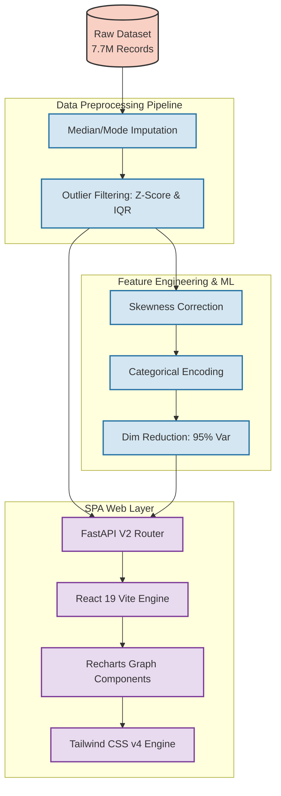

# Road Accident Severity Analysis

[](https://www.python.org/)
[](https://fastapi.tiangolo.com/)
[](https://react.dev/)
[](https://tailwindcss.com/)
[](https://recharts.org/)
[](https://pandas.pydata.org/)
[](https://scikit-learn.org/)

A comprehensive end-to-end data science project performing exploratory data analysis (EDA), data preprocessing, feature engineering, and dimensionality reduction on the **US Accidents** dataset, spanning over **7.7 million** accident records across the United States.

This project goes beyond backend modeling by fully integrating the analytical pipeline into a custom-engineered **Obsidian Lens SPA Dashboard**—a highly responsive, professional web platform powered by React 19, Recharts, Tailwind CSS v4, and FastAPI.

---

## 📑 Table of Contents
- [Overview](#-overview)
- [Obsidian Lens React Dashboard](#-obsidian-lens-react-dashboard)
- [System Architecture & Pipeline](#-system-architecture--pipeline)
- [Dataset Details](#-dataset-details)
- [Project Workflow](#-project-workflow)
- [Advanced Visualizations](#-advanced-visualizations)
- [Getting Started](#-getting-started)
- [Technologies Used](#-technologies-used)

---

## 🎯 Overview

This project analyzes traffic accident data to understand the exact geospatial, structural, and temporal factors driving accident severity across the US. The backend pipeline handles everything from multi-stage outlier removal to complex dimensionality reduction (PCA). The resulting optimized dataset is seamlessly served to a modern React-based frontend to deliver ultra-fast, interactive visual intelligence.

---

## 🌌 Obsidian Lens React Dashboard

The project features a completely decoupled frontend architecture built from the ground up for massive data transparency.

**Key SPA Features:**
- **Vite & React 19 Engine:** Seamless routing across `Overview`, `Key Metrics`, `Distribution`, `Correlation`, `Geospatial`, and `Insights` modules without full page reloads.
- **Dynamic Interpretations:** Every single interactive graph physically displays 2-3 bullet point professional business inferences generated directly beneath the chart arrays to ensure data literacy.
- **Adaptive Light/Dark Theme System:** Integrated `lucide-react` toggle mapping seamlessly between the base Obsidian Dark (Navy/Slate) and the Bright Sky Light environment, accurately pivoting complex SVG mapping lines and Tailwind utilities dynamically. 
- **Micro-Engineered Graphing (Recharts):** 
    - Custom SVG coordinate math ensuring microscopic Donut boundaries (Severity 1 & 4 factors) never overlap their UI labeling context.
    - Continuous Density (`connectNulls`) KDE curve interpolations for complex temperature Violin plots.
    - High-contrast custom Hex mappings highlighting massive Pearson correlation matrix outliers (Cyan/Orange structures vs background).
- **Live Computations:** Instantly computes live **Skewness Indexes** and **Kurtosis Profiles** via FASTAPI endpoints allowing direct UI feedback.

---

## 🏗️ System Architecture & Pipeline



---

## 💾 Dataset Details

| Property       | Detail                                           |
|----------------|--------------------------------------------------|
| **Records**     | 7,728,394                                        |
| **Features**    | 46 columns                                       |
| **Time Span**   | February 2016 – March 2023                      |

### Core Features Evaluated
| Category                | Important Variables                                                                                         |
|-------------------------|-------------------------------------------------------------------------------------------------------------|
| **Severity**            | `Severity` (Scale 1–4 indicating accident impact on traffic)                                                 |
| **Time/Weather**        | `Start_Time`, `Temperature(F)`, `Humidity(%)`, `Visibility(mi)`, `Wind_Speed(mph)`       |
| **Infrastructure**      | `Traffic_Signal`, `Junction`, `Crossing`, `Station`, `Stop`                          |

---

## 🚀 Project Workflow

### Phase 1: Data Preprocessing
- **Strategic Imputation:** Group-by based imputation for `Humidity`, `Pressure`, and `Visibility` mapping cleanly through `State` arrays.
- **Robust Outlier Removal:** Z-score validation isolated strict atmospheric constraints, while the IQR method systematically filtered anomalies across spatial configurations.

### Phase 2: Feature Engineering & PCA
- **Skewness Correction:** Applied `np.log1p` on Right-skewed limits and Yeo-Johnson algorithms on cascading distributions.
- **Standardization:** Employed `StandardScaler` to uniform array properties natively.
- **Machine Learning PCA:** Synthesized matrices through Principal Component Analysis ensuring **95% explained variance retention**, optimizing memory footprint.

---

## 📊 Advanced Visualizations Modules

- 🗺️ **Spatial Accident Density Scatter:** Visualises Continental US outlines purely mathematically leveraging exact coordinate accident frequency mapping.
- 🕒 **Temporal Heatmap:** Locates strict visual correlations targeting standard commuter rush-hour disaster intervals (7:00–9:00 AM & 3:00–6:00 PM) exclusively via time-matrix shading.
- 🚥 **Traffic Infrastructure Impact Constraints:** Evaluates exact hazard thresholds against local Roundabouts, Crossings, and Junction arrays via dynamic horizontal barring.
- 🏙️ **Top 15 Most Accident-Prone States:** Directly highlights geographic hotspots factoring out dense localized variables via natively parsed abbreviations mappings.
- 🧠 **PCA Component Clustering Models:** Exposes absolute Variance tracking alongside 2D cluster associations directly mapped by incident Severity outputs.

---

## 🛠️ Technologies Used

### Backend Stack
- **Python 3.10+ / FastAPI / Uvicorn**
- **Machine Learning:** `scikit-learn`, `scipy`
- **Data Engineering:** `pandas`, `numpy`

### Frontend Stack
- **React 19 / TypeScript / Vite**
- **Styling:** `Tailwind CSS v4` / Custom CSS Variables
- **Graphing Engine:** `Recharts` / `lucide-react`

---

## ⚙️ Getting Started

To launch the full stack environment locally, run both elements concurrently:

### 1. Launch FastAPI Backend
```bash
# In the terminal, from the root directory:
pip install -r requirements.txt
uvicorn main:app --reload
# Running on http://127.0.0.1:8000
```

### 2. Launch React Dashboard
```bash
# In a new terminal, navigate to the frontend:
cd dashboard
npm install
npm run dev
# Running on http://127.0.0.1:5173
```
Open **http://localhost:5173** to view the live dashboard!

---

## 📝 License
This project is provisioned strictly for analytical and educational research operations. The underlying origin data is provided through publicly accessible US records schemas.
